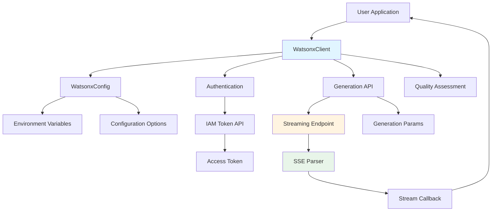
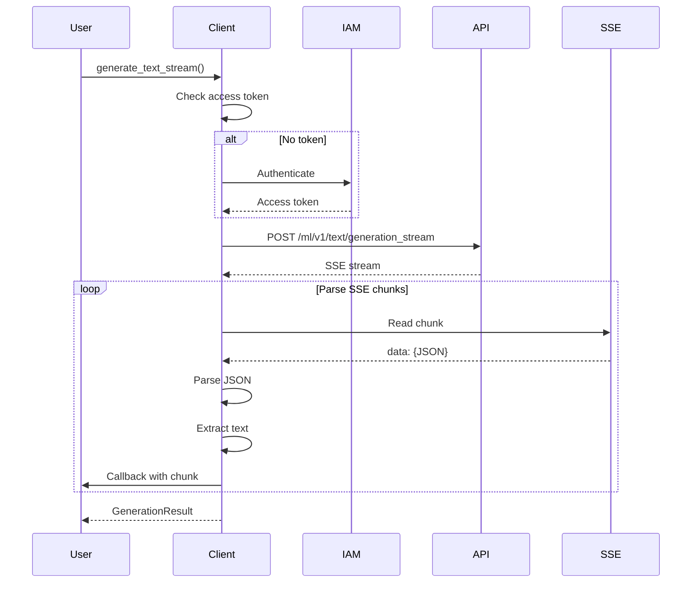
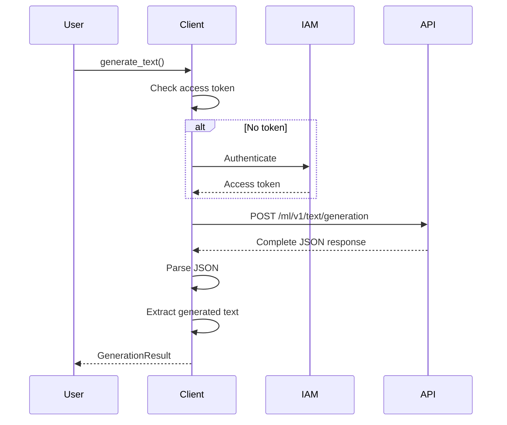
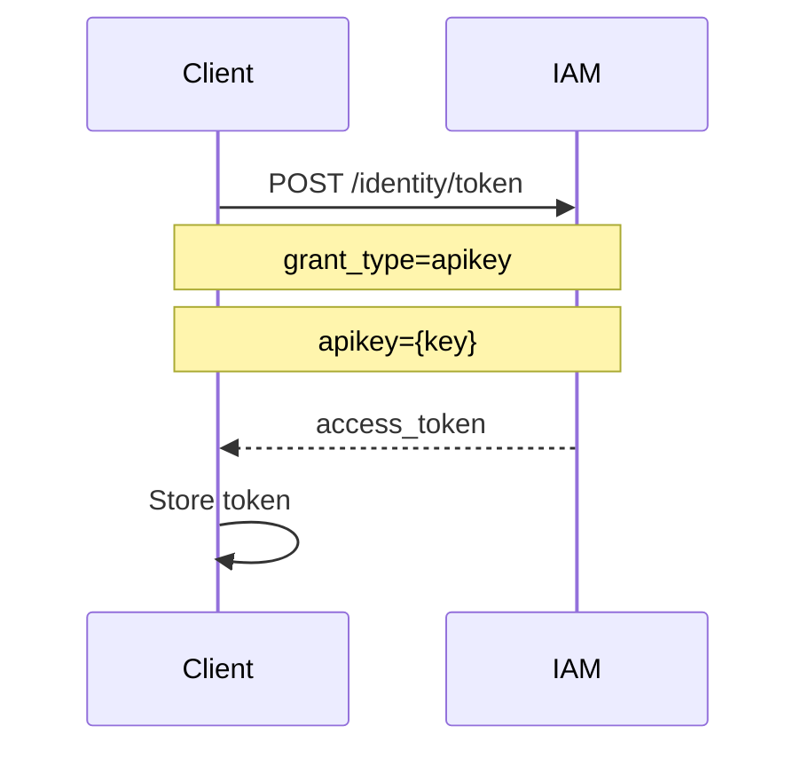

# Architecture

## Overview

WatsonX-RS is a Rust SDK for IBM WatsonX AI platform, providing a high-level interface for text generation with streaming support. The architecture emphasizes:

- **Async/Await**: Full async support with Tokio
- **Streaming**: Real-time Server-Sent Events (SSE) processing
- **Security**: Environment-based configuration
- **Type Safety**: Strong typing throughout
- **Error Handling**: Comprehensive error types

## Architecture Diagram



## Component Architecture

### Core Components

#### 1. `WatsonxClient` (src/client.rs)
The main client interface for interacting with WatsonX services.

**Responsibilities:**
- Manage authentication tokens
- Handle HTTP requests to WatsonX API
- Parse SSE streaming responses
- Provide quality assessment

**Key Methods:**
- `new()` - Create client from configuration
- `from_env()` - Create client from environment variables
- `connect()` - Authenticate and get access token
- `generate()` - Generate text (uses streaming internally)
- `generate_with_config()` - Generate with custom configuration
- `generate_text()` - Standard text generation (returns complete response)
- `generate_text_stream()` - Real-time streaming generation
- `list_models()` - Fetch available foundation models from API
- `assess_quality()` - Evaluate generated text quality

#### 2. `WatsonxConfig` (src/config.rs)
Configuration management for WatsonX client.

**Responsibilities:**
- Load configuration from environment variables
- Validate configuration
- Provide defaults
- Support multiple configuration sources

**Configuration Sources:**
1. Environment variables (`.env` file or system env)
2. Programmatic configuration
3. Default values

**Environment Variables:**
- `WATSONX_API_KEY` - IBM Cloud API key
- `WATSONX_PROJECT_ID` - WatsonX project ID
- `WATSONX_API_URL` - API base URL (default: us-south)
- `IAM_IBM_CLOUD_URL` - IAM authentication URL
- `WATSONX_API_VERSION` - API version
- `WATSONX_TIMEOUT_SECS` - Request timeout

#### 3. `GenerationConfig` (src/types.rs)
Configuration for text generation requests.

**Responsibilities:**
- Define generation parameters
- Provide factory methods for common configurations
- Validate parameter ranges

**Key Parameters:**
- `model_id` - Model to use
- `max_tokens` - Maximum tokens to generate
- `timeout` - Request timeout
- `top_k`, `top_p` - Sampling parameters
- `stop_sequences` - Stop generation triggers
- `repetition_penalty` - Penalty for repetition

**Configuration Presets:**
- `default()` - Standard configuration
- `long_form()` - For long responses (128k tokens)
- `quick_response()` - Fast responses (2k tokens)

#### 4. `Error` Types (src/error.rs)
Comprehensive error handling.

**Error Variants:**
- `Network` - Network/connection errors
- `Authentication` - Auth failures
- `Api` - API errors from WatsonX
- `Timeout` - Request timeouts
- `Serialization` - JSON parsing errors
- `Configuration` - Config validation errors
- `InvalidInput` - Invalid user input
- `RateLimit` - Rate limiting
- `ModelNotFound` - Invalid model
- `ProjectNotFound` - Invalid project

#### 5. Model Constants (src/models.rs)
Constants for available WatsonX models.

**Supported Models:**
- `ibm/granite-4-h-small` (default)
- `ibm/granite-3-3-8b-instruct`
- `ibm/granite-3-0-8b-instruct`
- `ibm/granite-3-0-70b-instruct`
- `ibm/granite-2-0-8b-instruct`
- `ibm/granite-2-0-70b-instruct`
- `ibm/granite-1-3-8b-instruct`
- `ibm/granite-1-3-70b-instruct`

#### 6. Model Information (src/types.rs)
Dynamic model information fetched from WatsonX API.

**ModelInfo Structure:**
- `model_id` - Unique model identifier
- `name` - Human-readable model name
- `description` - Model description
- `provider` - Model provider (e.g., IBM)
- `version` - Model version
- `supported_tasks` - List of supported tasks
- `max_context_length` - Maximum context length
- `available` - Availability status

## Data Flow

### Streaming Generation Flow



### Non-streaming Generation Flow



### Authentication Flow



## SSE Parsing

The SDK implements proper Server-Sent Events parsing for streaming responses:

**Format:**
```
data: {"results":[{"generated_text":"chunk1"}]}

data: {"results":[{"generated_text":"chunk2"}]}

data: [DONE]
```

**Parsing Logic:**
1. Read stream chunks as bytes
2. Convert to UTF-8 strings
3. Buffer until complete lines
4. Parse `data:` prefixed lines
5. Extract JSON from data payload
6. Extract generated text from results
7. Call callback with each chunk
8. Accumulate total response

## Error Handling Strategy

### Error Propagation
- All async functions return `Result<T, Error>`
- Errors propagate up the call stack
- User can pattern match on error types

### Error Context
- Each error variant includes descriptive message
- Network errors include underlying cause
- API errors include HTTP status and response

### Error Recovery
- Authentication errors can be retried after reconnecting
- Network errors can be retried
- Timeout errors should use larger timeout
- Validation errors require user action

## Quality Assessment

Built-in quality scoring algorithm evaluates:

1. **Length Check** (30%): Non-empty and reasonable length (8-200 chars)
2. **Common Patterns** (20%): Contains common English words
3. **No Error Indicators** (20%): Doesn't contain error words
4. **Sentence Structure** (15%): Has proper sentences
5. **Word Count** (15%): Reasonable word count (3-100 words)

Returns score from 0.0 to 1.0

## Thread Safety

- Client is not thread-safe by design (async only)
- Configuration is thread-safe (immutable after creation)
- Error types are thread-safe
- Generation results are thread-safe

## Performance Considerations

### Streaming
- Uses async streams for real-time processing
- No buffering delays
- Callback fired immediately for each chunk

### Memory
- Streams processed incrementally
- Large responses don't require full memory allocation
- No unnecessary cloning

### Network
- Single connection for streaming
- Token cached in memory (not persisted)
- Connection timeout configurable

## Security

### Credentials
- Never hardcoded in examples
- Load from environment variables
- `.env` file excluded from version control

### API Communication
- HTTPS for all API calls
- Bearer token authentication
- Tokens not logged or exposed

### Dependencies
- All dependencies from crates.io
- Regular security updates
- No unsafe code blocks

## Testing Strategy

### Unit Tests
- Configuration validation
- Quality assessment logic
- Error handling

### Integration Tests
- Configuration from environment
- Client creation
- Model access
- Constant values

### Snapshot Tests
- Configuration snapshots
- Quality assessment results
- Model constants

## Future Enhancements

### Potential Improvements
- Connection pooling
- Token caching with expiration
- Retry logic with backoff
- Metrics and observability
- Batch request support
- Chat completion API support

### Architecture Considerations
- Keep client lightweight
- Maintain async-first design
- Preserve type safety
- Keep error handling comprehensive
- Maintain streaming as primary interface

