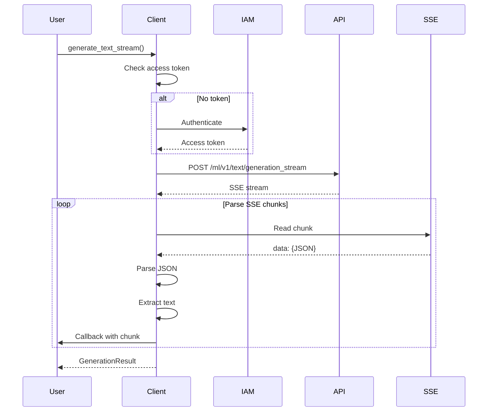
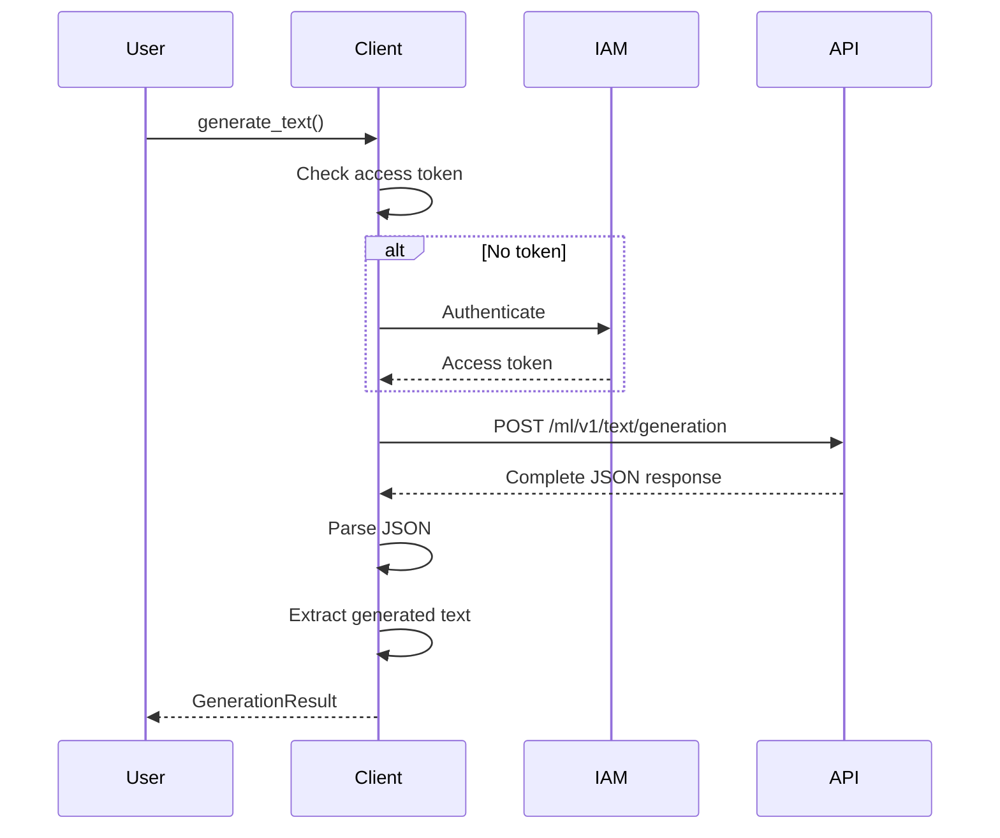
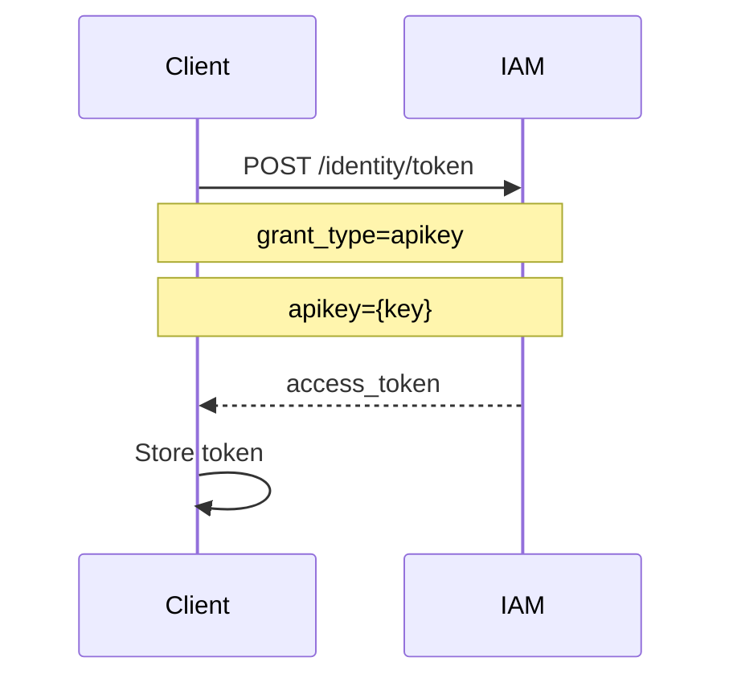
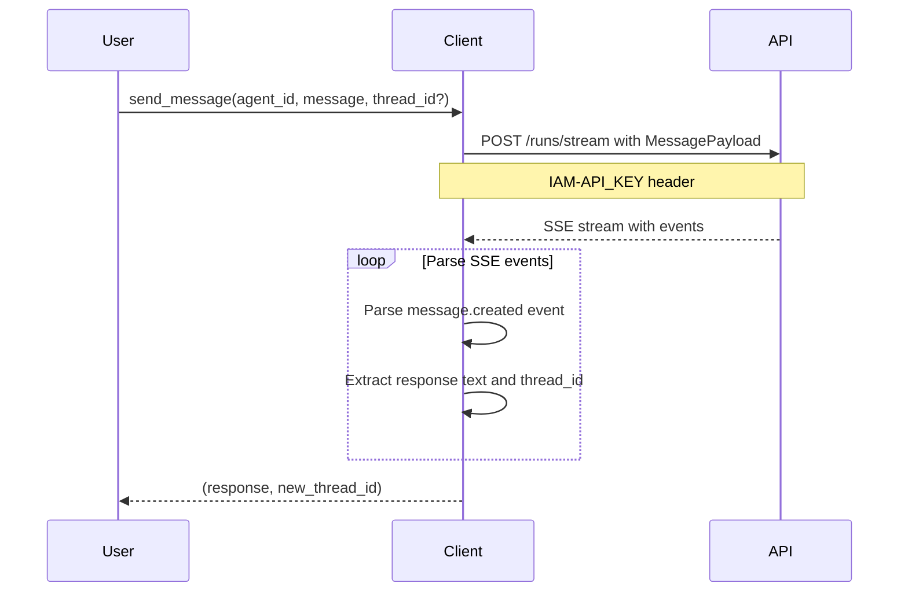
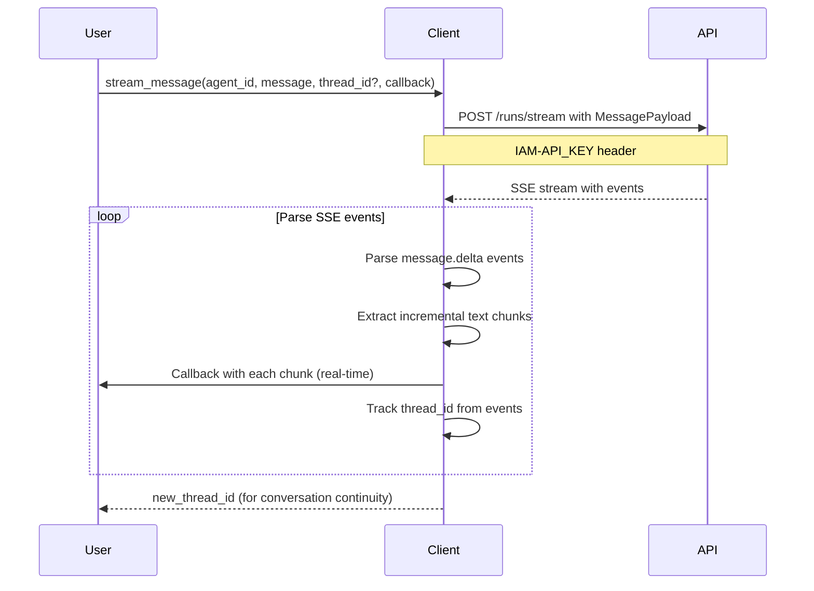

# Architecture

## Overview

WatsonX-RS is a Rust SDK for IBM WatsonX AI platform, providing high-level interfaces for:
- **watsonx.ai**: Text generation with streaming support
- **watsonx.orchestrate**: Agent management and chat functionality

The architecture emphasizes:

- **Async/Await**: Full async support with Tokio
- **Streaming**: Real-time Server-Sent Events (SSE) processing
- **Security**: Environment-based configuration
- **Type Safety**: Strong typing throughout
- **Error Handling**: Comprehensive error types
- **Simplicity**: Following wxo-client-main patterns for consistency

## Architecture Diagram

```mermaid
graph TB
    A[User Application] --> B[WatsonxClient]
    A --> O[OrchestrateClient]
    
    B --> C[WatsonxConfig]
    B --> D[Authentication]
    B --> E[Generation API]
    
    C --> F[Environment Variables]
    C --> G[Configuration Options]
    
    D --> H[IAM Token API]
    H --> I[Access Token]
    
    E --> J[Streaming Endpoint]
    E --> K[Generation Params]
    
    J --> L[SSE Parser]
    L --> M[Stream Callback]
    M --> A
    
    B --> N[Quality Assessment]
    
    O --> P[OrchestrateConfig]
    O --> Q[Agent API]
    O --> R[Chat API]
    
    P --> F
    P --> S[Instance ID + Region]
    
    Q --> T[/agents endpoint]
    R --> U[/runs/stream endpoint]
    
    U --> V[Orchestrate SSE Parser]
    V --> W[Event Parser]
    W --> X[message.created/delta]
    X --> A
    
    style B fill:#e1f5ff
    style O fill:#ffe1f5
    style J fill:#fff4e1
    style L fill:#e8f5e9
    style V fill:#e8f5e9
```

## Component Architecture

### Core Components

#### 1. `WatsonxClient` (src/client.rs)
The main client interface for interacting with WatsonX services.

**Responsibilities:**
- Manage authentication tokens
- Handle HTTP requests to WatsonX API
- Parse SSE streaming responses
- Provide quality assessment

**Key Methods:**
- `new()` - Create client from configuration
- `from_env()` - Create client from environment variables
- `connect()` - Authenticate and get access token
- `generate()` - Generate text (uses streaming internally)
- `generate_with_config()` - Generate with custom configuration
- `generate_text()` - Standard text generation (returns complete response)
- `generate_text_stream()` - Real-time streaming generation
- `list_models()` - Fetch available foundation models from API
- `assess_quality()` - Evaluate generated text quality

#### 2. `WatsonxConfig` (src/config.rs)
Configuration management for WatsonX client.

**Responsibilities:**
- Load configuration from environment variables
- Validate configuration
- Provide defaults
- Support multiple configuration sources

**Configuration Sources:**
1. Environment variables (`.env` file or system env)
2. Programmatic configuration
3. Default values

**Environment Variables:**
- `WATSONX_API_KEY` - IBM Cloud API key
- `WATSONX_PROJECT_ID` - WatsonX project ID
- `WATSONX_API_URL` - API base URL (default: us-south)
- `IAM_IBM_CLOUD_URL` - IAM authentication URL
- `WATSONX_API_VERSION` - API version
- `WATSONX_TIMEOUT_SECS` - Request timeout

#### 3. `GenerationConfig` (src/types.rs)
Configuration for text generation requests.

**Responsibilities:**
- Define generation parameters
- Provide factory methods for common configurations
- Validate parameter ranges

**Key Parameters:**
- `model_id` - Model to use
- `max_tokens` - Maximum tokens to generate
- `timeout` - Request timeout
- `top_k`, `top_p` - Sampling parameters
- `stop_sequences` - Stop generation triggers
- `repetition_penalty` - Penalty for repetition

**Configuration Presets:**
- `default()` - Standard configuration
- `long_form()` - For long responses (128k tokens)
- `quick_response()` - Fast responses (2k tokens)

#### 4. `Error` Types (src/error.rs)
Comprehensive error handling.

**Error Variants:**
- `Network` - Network/connection errors
- `Authentication` - Auth failures
- `Api` - API errors from WatsonX
- `Timeout` - Request timeouts
- `Serialization` - JSON parsing errors
- `Configuration` - Config validation errors
- `InvalidInput` - Invalid user input
- `RateLimit` - Rate limiting
- `ModelNotFound` - Invalid model
- `ProjectNotFound` - Invalid project

#### 5. Model Constants (src/models.rs)
Constants for available WatsonX models.

**Supported Models:**
- `ibm/granite-4-h-small` (default)
- `ibm/granite-3-3-8b-instruct`
- `ibm/granite-3-0-8b-instruct`
- `ibm/granite-3-0-70b-instruct`
- `ibm/granite-2-0-8b-instruct`
- `ibm/granite-2-0-70b-instruct`
- `ibm/granite-1-3-8b-instruct`
- `ibm/granite-1-3-70b-instruct`

#### 6. Model Information (src/types.rs)
Dynamic model information fetched from WatsonX API.

**ModelInfo Structure:**
- `model_id` - Unique model identifier
- `name` - Human-readable model name
- `description` - Model description
- `provider` - Model provider (e.g., IBM)
- `version` - Model version
- `supported_tasks` - List of supported tasks
- `max_context_length` - Maximum context length
- `available` - Availability status

#### 7. `OrchestrateClient` (src/orchestrate/client.rs)
Client for WatsonX Orchestrate agent management and chat functionality.

**Responsibilities:**
- Manage agent discovery and selection
- Handle chat interactions with agents
- Maintain conversation context (thread_id)
- Parse Orchestrate-specific SSE events
- Manage tools, threads, runs, and documents

**Key Methods:**
- `new()` - Create client from OrchestrateConfig
- `list_agents()` - Discover available agents
- `send_message()` - Send message and get response (non-streaming)
- `stream_message()` - Send message with real-time streaming response
- `update_tool()`, `delete_tool()`, `test_tool()` - Tool management
- `get_tool_versions()`, `get_tool_execution_history()` - Tool tracking
- `chat_with_docs()`, `stream_chat_with_docs()` - Document Q&A

**Configuration:**
- Simplified config (matching wxo-client-main pattern)
- Only requires: `instance_id` and `region`
- Loads from environment: `WXO_INSTANCE_ID`, `WXO_REGION`, `WATSONX_API_KEY`

#### 8. `OrchestrateConfig` (src/orchestrate/config.rs)
Simplified configuration for Watson Orchestrate operations.

**Responsibilities:**
- Load configuration from environment variables
- Construct base URL from instance_id and region
- Provide defaults (region defaults to "us-south")

**Environment Variables:**
- `WXO_INSTANCE_ID` - Watson Orchestrate instance ID (required)
- `WXO_REGION` - Region (optional, defaults to "us-south")
- `WATSONX_API_KEY` - API key for authentication (or `IAM_API_KEY`, `WO_API_KEY`)

**Base URL Construction:**
```
https://api.{region}.watson-orchestrate.cloud.ibm.com/instances/{instance_id}/v1/orchestrate
```

#### 9. Orchestrate Module Structure (src/orchestrate/)
Modular organization of Orchestrate functionality.

**Module Organization:**
- `mod.rs` - Module root and re-exports
- `config.rs` - Configuration management
- `client.rs` - Client implementation
- `types.rs` - All types and data structures

**Benefits:**
- Clear separation of concerns
- Easier to maintain and extend
- Logical namespace hierarchy
- Better code discoverability

## Data Flow

### Streaming Generation Flow



### Non-streaming Generation Flow



### Authentication Flow



### Orchestrate Chat Flow (Non-streaming)



### Orchestrate Chat Flow (Streaming)



## SSE Parsing

The SDK implements proper Server-Sent Events parsing for streaming responses:

**Format:**
```
data: {"results":[{"generated_text":"chunk1"}]}

data: {"results":[{"generated_text":"chunk2"}]}

data: [DONE]
```

**Parsing Logic:**
1. Read stream chunks as bytes
2. Convert to UTF-8 strings
3. Buffer until complete lines
4. Parse `data:` prefixed lines
5. Extract JSON from data payload
6. Extract generated text from results
7. Call callback with each chunk
8. Accumulate total response

### Orchestrate SSE Event Parsing

The Orchestrate client parses Orchestrate-specific SSE events:

**Event Types:**
- `message.created` - Final complete message (for non-streaming)
- `message.delta` - Incremental text chunks (for streaming)

**Format:**
```
{"event":"message.created","data":{"message":{"content":[{"text":"Full response"}],"thread_id":"..."}}}
{"event":"message.delta","data":{"delta":{"content":[{"text":"chunk1"}]},"thread_id":"..."}}
{"event":"message.delta","data":{"delta":{"content":[{"text":"chunk2"}]},"thread_id":"..."}}
```

**Parsing Logic:**
1. Read SSE stream line by line
2. Parse JSON event data
3. For `message.created`: Extract full response text and thread_id
4. For `message.delta`: Extract incremental chunks and call callback
5. Maintain thread_id for conversation continuity

## Error Handling Strategy

### Error Propagation
- All async functions return `Result<T, Error>`
- Errors propagate up the call stack
- User can pattern match on error types

### Error Context
- Each error variant includes descriptive message
- Network errors include underlying cause
- API errors include HTTP status and response

### Error Recovery
- Authentication errors can be retried after reconnecting
- Network errors can be retried
- Timeout errors should use larger timeout
- Validation errors require user action

## Quality Assessment

Built-in quality scoring algorithm evaluates:

1. **Length Check** (30%): Non-empty and reasonable length (8-200 chars)
2. **Common Patterns** (20%): Contains common English words
3. **No Error Indicators** (20%): Doesn't contain error words
4. **Sentence Structure** (15%): Has proper sentences
5. **Word Count** (15%): Reasonable word count (3-100 words)

Returns score from 0.0 to 1.0

## Thread Safety

- Client is not thread-safe by design (async only)
- Configuration is thread-safe (immutable after creation)
- Error types are thread-safe
- Generation results are thread-safe

## Performance Considerations

### Streaming
- Uses async streams for real-time processing
- No buffering delays
- Callback fired immediately for each chunk

### Memory
- Streams processed incrementally
- Large responses don't require full memory allocation
- No unnecessary cloning

### Network
- Single connection for streaming
- Token cached in memory (not persisted)
- Connection timeout configurable

## Security

### Credentials
- Never hardcoded in examples
- Load from environment variables
- `.env` file excluded from version control

### API Communication
- HTTPS for all API calls
- Bearer token authentication
- Tokens not logged or exposed

### Dependencies
- All dependencies from crates.io
- Regular security updates
- No unsafe code blocks

## Testing Strategy

### Unit Tests
- Configuration validation
- Quality assessment logic
- Error handling

### Integration Tests
- Configuration from environment
- Client creation
- Model access
- Constant values

### Snapshot Tests
- Configuration snapshots
- Quality assessment results
- Model constants

## Orchestrate SDK Enhancements (Latest)

### Recent Improvements
- ✅ Flexible response parsing for API variations
- ✅ Graceful degradation for unavailable endpoints (404 handling)
- ✅ Optional Tool fields for compatibility with different API versions
- ✅ Comprehensive examples (basic, chat, advanced, use cases, chat with documents)
- ✅ Real-time streaming with proper SSE parsing
- ✅ Thread-based conversation context management
- ✅ Batch message processing support
- ✅ Tool execution and management (execute, update, delete, test)
- ✅ Tool versioning and execution history tracking
- ✅ Chat with documents (Q&A on uploaded documents)
- ✅ Modular code organization (config, client, types)
- ✅ Bearer token authentication with X-Instance-ID headers
- ✅ Multiple endpoint path fallbacks for robustness

### Robustness Features
- Multiple response format support (direct arrays, wrapped objects)
- Fallback parsing strategies for API variations
- Empty collection returns for unavailable endpoints (instead of errors)
- Consistent error handling across all endpoints
- Graceful degradation when optional features are unavailable
- Multiple endpoint path attempts for better compatibility
- Flexible document handling with fallback support

## Future Enhancements

### Potential Improvements
- Connection pooling for better performance
- Token caching with expiration
- Retry logic with exponential backoff
- Metrics and observability
- Enhanced document collection features (full CRUD operations)
- Session management abstraction (thread_id management)
- WebSocket support for Orchestrate (if available)
- Advanced streaming control options

### Architecture Considerations
- Keep client lightweight and simple
- Maintain async-first design
- Preserve type safety
- Keep error handling comprehensive
- Maintain streaming as primary interface for real-time features
- Follow established patterns (wxo-client-main, WatsonX API conventions)
- Keep configuration simple (environment-based, minimal fields)
- Prioritize graceful degradation over strict error handling

